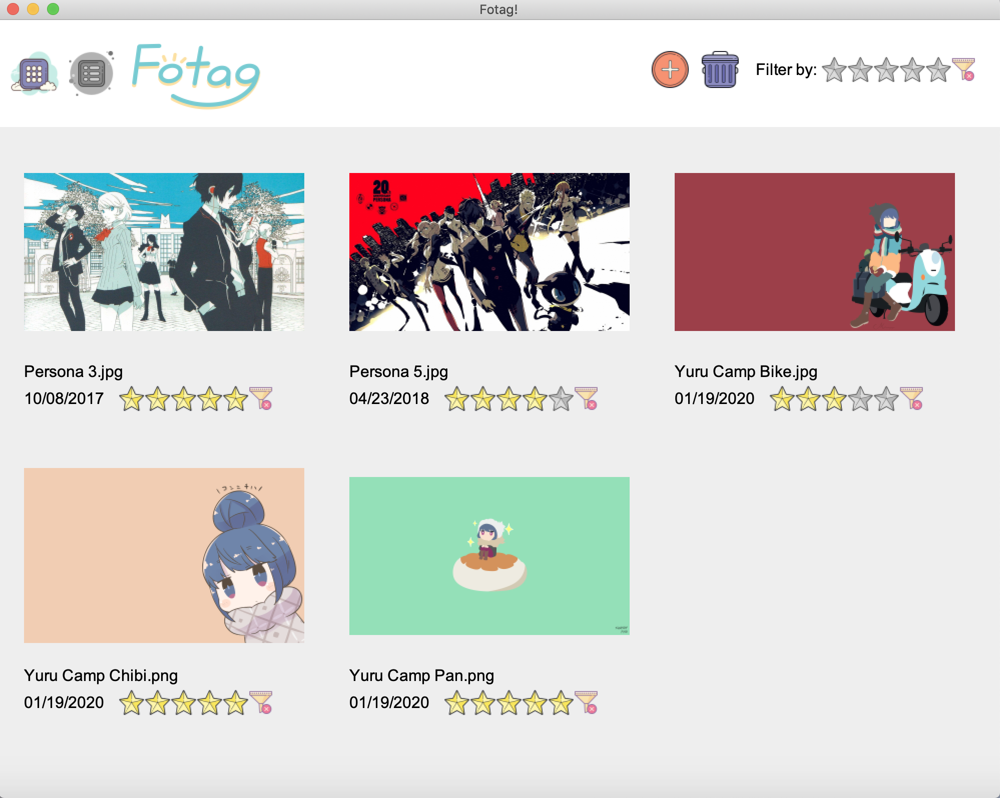
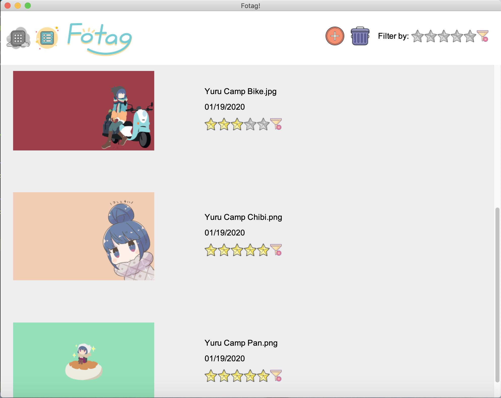

# Fotag! 🖼
Fotag is an interactive desktop gallery application. 
It allows users to upload images, delete images, rate images and filter images by rating. The dynamic layout of the images responds to resizing and selected view option (grid / list). 

## Preview
- Grid View Mode

- List View Mode


## Get Started
  - To get start with the application, please navigate to the root folder of the project, and run the following commands on the terminal.
  ```
  make
  make run
  ```

## How to Use it
### Toolbar:
- Import: The import button  will prompt the file explorer, where the user can select one or multiple image files to be loaded to the list of images being displayed. The images imported will be cached and can be displayed next time when the user opens up the application.
- Clear: The clear button  allows the user to clear the images previously imported and clean the cache.
- Filter: The filter button, showing 5-stars , used to filter the image list based on rating. If a rating is selected, the gallery will only display images that have that rating or higher. The filter can be cleared by clicking  besides the rating.
### Image:
- Rating: Hover over the stars and click the rating to rate each image. Click on  will clear the rating.
- Enlarge View: Simply click the thumbnail image to get enlarged image on screen. Rating functionality is still availbal on the sidebar of the enlarged view. To return to the thumbnail mode, click on the enlarged image or the close button.
### View Mode:
- Grid view and list view are available to the gallery. Click on  or  to switch the mode suitable for you.

<br/>
<br/>

_Hope you enjoy playing with this application ^-^_

&copy; Kaiwen Chen k2999che@edu.uwaterloo.ca
